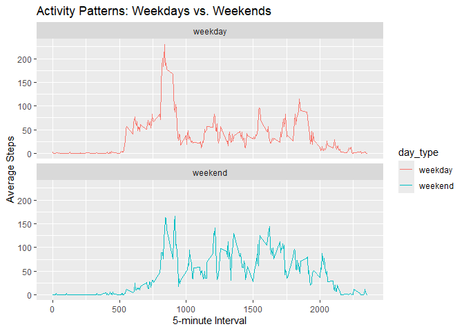

## Loading and preprocessing the data


``` r
# Load necessary libraries
library(dplyr)
```

```
## Warning: package 'dplyr' was built under R version 4.4.3
```

```
## 
## Attaching package: 'dplyr'
```

```
## The following objects are masked from 'package:stats':
## 
##     filter, lag
```

```
## The following objects are masked from 'package:base':
## 
##     intersect, setdiff, setequal, union
```

``` r
library(ggplot2)
```

```
## Warning: package 'ggplot2' was built under R version 4.4.3
```

``` r
# Unzip and load the dataset
unzip("activity.zip")
activity <- read.csv("activity.csv")

# Convert date column to Date type
activity$date <- as.Date(activity$date)

# Calculate total steps per day
total_steps_per_day <- activity %>%
  group_by(date) %>%
  summarise(total_steps = sum(steps, na.rm = TRUE))

# Histogram of total steps per day
hist(total_steps_per_day$total_steps, col="blue",
     main="Total Steps per Day", xlab="Steps")
```

<!-- -->

``` r
# Calculate mean and median
mean_steps <- mean(total_steps_per_day$total_steps, na.rm=TRUE)
median_steps <- median(total_steps_per_day$total_steps, na.rm=TRUE)

# Print mean and median
mean_steps
```

```
## [1] 9354.23
```

``` r
median_steps
```

```
## [1] 10395
```

``` r
# Calculate average steps for each 5-minute interval
average_activity <- activity %>%
  group_by(interval) %>%
  summarise(avg_steps = mean(steps, na.rm = TRUE))

# Plot time series
plot(average_activity$interval, average_activity$avg_steps, type="l", col="red",
     xlab="5-minute Interval", ylab="Average Steps", main="Average Daily Activity Pattern")
```

<!-- -->

``` r
# Find interval with max steps
max_interval <- average_activity[which.max(average_activity$avg_steps), ]
max_interval
```

```
## # A tibble: 1 × 2
##   interval avg_steps
##      <int>     <dbl>
## 1      835      206.
```

``` r
# Count missing values
missing_values <- sum(is.na(activity$steps))

# Replace NAs with mean for the corresponding interval
activity_imputed <- activity
for (i in 1:nrow(activity_imputed)) {
  if (is.na(activity_imputed$steps[i])) {
    interval_value <- activity_imputed$interval[i]
    mean_value <- average_activity$avg_steps[average_activity$interval == interval_value]
    activity_imputed$steps[i] <- mean_value
  }
}

# Histogram of total steps per day (after imputation)
total_steps_per_day_imputed <- activity_imputed %>%
  group_by(date) %>%
  summarise(total_steps = sum(steps))

hist(total_steps_per_day_imputed$total_steps, col="green",
     main="Total Steps per Day (After Imputation)", xlab="Steps")
```

<!-- -->

``` r
# New mean and median
mean_steps_imputed <- mean(total_steps_per_day_imputed$total_steps)
median_steps_imputed <- median(total_steps_per_day_imputed$total_steps)

# Print mean and median after imputation
mean_steps_imputed
```

```
## [1] 10766.19
```

``` r
median_steps_imputed
```

```
## [1] 10766.19
```

``` r
# Create a new factor variable for weekday/weekend
activity_imputed$day_type <- ifelse(weekdays(activity_imputed$date) %in% c("Saturday", "Sunday"), "weekend", "weekday")
activity_imputed$day_type <- as.factor(activity_imputed$day_type)

# Calculate average steps by interval and day type
activity_by_day <- activity_imputed %>%
  group_by(interval, day_type) %>%
  summarise(avg_steps = mean(steps))
```

```
## `summarise()` has grouped output by 'interval'. You can override using the
## `.groups` argument.
```

``` r
# Plot weekday vs. weekend
ggplot(activity_by_day, aes(x=interval, y=avg_steps, color=day_type)) +
  geom_line() +
  facet_wrap(~day_type, ncol=1) +
  labs(title="Activity Patterns: Weekdays vs. Weekends",
       x="5-minute Interval", y="Average Steps")
```

<!-- -->
